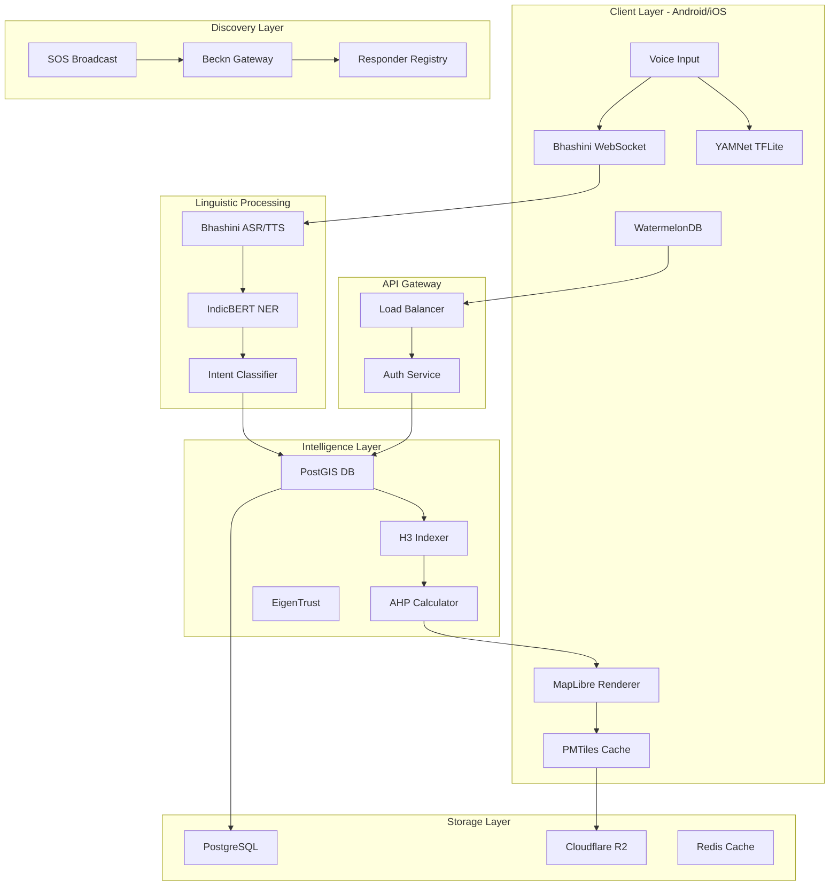

# Design Document: MargMitra (The Civic Neural Grid)

## Overview

MargMitra is a civic safety platform built using the MERN stack (MongoDB, Express.js, React, Node.js). The system follows a three-layer architecture: (1) Voice Interaction Layer for multilingual voice commands, (2) Intelligence Layer for spatial safety analysis and routing, and (3) Response Coordination Layer for emergency response management.

The design prioritizes real-time operation with offline fallback capabilities. This is achieved through React Progressive Web App (PWA) features, MongoDB for flexible data storage, and Node.js microservices for scalable backend processing.

**Key Design Principles**:
- **Progressive Web App**: Core features work offline via service workers; sync when available
- **Multilingual Support**: Voice-first interaction using Web Speech API and cloud translation services
- **Coordinated Safety**: Emergency response coordinated across volunteers, NGOs, private security, and government
- **Privacy by Design**: Location data anonymized using geohashing; HTTPS encryption for all data transmission
- **Real-time Updates**: WebSocket connections for live safety updates and emergency broadcasts

## Architecture

### System Architecture Diagram



### Layer Descriptions

**Client Layer**: Mobile applications (Android/iOS) with offline-first capabilities. Handles voice input, map rendering, and local data persistence.

**API Gateway Layer**: Entry point for all client requests. Handles authentication, rate limiting, and request routing.

**Linguistic Processing Layer**: Converts vernacular voice input to structured intents. Bhashini provides real-time ASR/TTS, IndicBERT extracts entities, and Intent Classifier determines user goals.

**Intelligence Layer**: Spatial safety analysis and route optimization. PostGIS stores geographic data, H3 Indexer creates hexagonal safety buckets, AHP Calculator weights safety factors, and EigenTrust validates crowdsourced data.

**Discovery Layer**: Decentralized emergency response coordination using Beckn Protocol. Broadcasts SOS signals and collects responses from multiple stakeholder types.

**Storage Layer**: Persistent data storage. PostgreSQL with PostGIS extension for spatial data, Cloudflare R2 for serverless PMTiles hosting, Redis for caching frequently accessed data.

## Components and Interfaces

### 1. Voice Interaction Module

**Purpose**: Enable vernacular voice-first interaction for illiterate and low-literacy users.

**Components**:
- **BhashiniClient**: WebSocket client maintaining persistent connection to Bhashini API
- **AudioStreamManager**: Captures microphone input and streams to Bhashini
- **TTSPlayer**: Plays synthesized speech responses in user's language
- **FallbackASR**: Local whisper-tiny.tflite model for offline voice recognition

**Interfaces**:

```typescript
interface VoiceInteractionService {
  // Initialize voice session with language preference
  startVoiceSession(languageCode: string): Promise<SessionId>
  
  // Stream audio chunks to Bhashini
  streamAudio(sessionId: SessionId, audioChunk: ArrayBuffer): void
  
  // Receive transcribed text from Bhashini
  onTranscription(callback: (text: string, language: string) => void): void
  
  // Synthesize and play text-to-speech
  speak(text: string, languageCode: string): Promise<void>
  
  // Fallback to local ASR when offline
  processOfflineAudio(audioBuffer: ArrayBuffer): Promise<string>
}
```

**Key Design Decisions**:
- WebSocket for bi-directional streaming to minimize latency (<200ms target)
- Fallback to local TFLite model when internet unavailable
- Audio buffering to handle network jitter
- Language auto-detection based on device locale and user history

### 2. Named Entity Recognition Module

**Purpose**: Extract locations, intents, and entities from vernacular speech.

**Components**:
- **IndicBERTProcessor**: Runs IndicBERT model for NER on translated text
- **EntityResolver**: Maps extracted entities to geographic coordinates
- **IntentClassifier**: Determines user intent (SOS, navigation, query, report)
- **ContextManager**: Maintains conversation context for multi-turn interactions

**Interfaces**:

```typescript
interface NERService {
  // Extract entities from text
  extractEntities(text: string, language: string): Promise<Entity[]>
  
  // Resolve location entity to coordinates
  resolveLocation(locationEntity: string, context: UserContext): Promise<Coordinates>
  
  // Classify user intent
  classifyIntent(text: string, entities: Entity[]): Intent
}

type Entity = {
  type: 'LOCATION' | 'PERSON' | 'TIME' | 'EMERGENCY_TYPE'
  value: string
  confidence: number
}

type Intent = 
  | { type: 'SOS', emergencyType: string }
  | { type: 'NAVIGATE', destination: Coordinates }
  | { type: 'QUERY_SAFETY', location: Coordinates }
  | { type: 'REPORT_INCIDENT', incidentType: string, location: Coordinates }
```

**Key Design Decisions**:
- IndicBERT chosen for superior performance on Indian languages vs. multilingual BERT
- Local geocoding database for common landmarks to reduce API calls
- Confidence thresholds: >0.85 for auto-execution, 0.6-0.85 for confirmation prompt, <0.6 for clarification
- Context window of 5 previous utterances for disambiguation

### 3. Offline Map Module

**Purpose**: Provide vector map rendering without internet connectivity.

**Components**:
- **PMTilesCache**: Manages local storage of PMTiles archives
- **MapLibreRenderer**: Renders vector tiles using MapLibre GL
- **TileDownloader**: Pre-downloads tiles for user's city and frequent routes
- **StyleManager**: Applies safety-aware map styling (color-coded hexagons)

**Interfaces**:

```typescript
interface OfflineMapService {
  // Download PMTiles for a geographic region
  downloadRegion(bounds: BoundingBox, priority: 'HIGH' | 'NORMAL' | 'LOW'): Promise<void>
  
  // Check if tiles are available offline for a location
  isAvailableOffline(location: Coordinates): boolean
  
  // Render map with safety overlay
  renderMap(center: Coordinates, zoom: number, safetyLayer: boolean): MapView
  
  // Get storage usage and manage cache
  getCacheStats(): CacheStats
  evictLowPriorityTiles(bytesToFree: number): Promise<void>
}
```

**Key Design Decisions**:
- PMTiles chosen over MBTiles for serverless hosting on Cloudflare R2 (no database required)
- Resolution 9 H3 hexagons (174m edge) for urban areas, Resolution 10 (66m) for high-density zones
- Automatic cache management: prioritize high-risk areas and frequent routes
- Vector tiles allow dynamic styling without re-downloading data

### 4. Safety Intelligence Module

**Purpose**: Calculate and maintain safety scores for geographic areas.

**Components**:
- **H3Indexer**: Converts coordinates to H3 hexagon identifiers
- **SafetyAggregator**: Combines multiple data sources into safety scores
- **AHPCalculator**: Applies Analytic Hierarchy Process for multi-criteria weighting
- **CrowdsourceValidator**: Uses EigenTrust to validate user-submitted data

**Interfaces**:

```typescript
interface SafetyIntelligenceService {
  // Get safety score for a hexagon
  getSafetyScore(h3Index: string): Promise<SafetyScore>
  
  // Calculate safe route between two points
  calculateSafeRoute(origin: Coordinates, destination: Coordinates, preferences: RoutePreferences): Promise<Route>
  
  // Submit crowdsourced safety observation
  submitObservation(observation: SafetyObservation, userId: string): Promise<void>
  
  // Get user's reputation score
  getReputationScore(userId: string): Promise<number>
}

type SafetyScore = {
  h3Index: string
  overallScore: number // 0-100
  factors: {
    crimeRate: number
    streetlightDensity: number
    crowdDensity: number
    policePresence: number
  }
  lastUpdated: Date
  confidence: number
}

type RoutePreferences = {
  safetyWeight: number // 0-1, where 1 = maximum safety priority
  avoidDarkAreas: boolean
  preferCrowdedRoutes: boolean
}
```

**Key Design Decisions**:
- H3 hexagons provide consistent area-based bucketing (vs. irregular administrative boundaries)
- AHP ensures mathematically consistent weighting of safety factors
- EigenTrust prevents Sybil attacks by calculating transitive trust
- Safety scores updated every 15 minutes during peak hours, hourly during off-peak


### 5. Beckn Protocol Integration Module

**Purpose**: Enable decentralized discovery of emergency responders.

**Components**:
- **BecknGatewayClient**: Communicates with Beckn Gateway for SOS broadcasts
- **ResponderRegistry**: Maintains list of available responders and their capabilities
- **WorkflowOrchestrator**: Manages Beckn protocol state machine (search → on_search → init → confirm)
- **ResponseAggregator**: Collects and ranks responder responses

**Interfaces**:

```typescript
interface BecknService {
  // Broadcast SOS as Beckn search intent
  broadcastSOS(sos: SOSRequest): Promise<TransactionId>
  
  // Receive responder responses
  onResponderResponse(callback: (response: ResponderOffer) => void): void
  
  // Select and confirm responder
  confirmResponder(transactionId: TransactionId, responderId: string): Promise<ConfirmationResult>
  
  // Cancel SOS broadcast
  cancelSOS(transactionId: TransactionId): Promise<void>
}

type SOSRequest = {
  location: Coordinates
  emergencyType: 'MEDICAL' | 'SAFETY_THREAT' | 'ACCIDENT' | 'FIRE' | 'OTHER'
  severity: 'LOW' | 'MEDIUM' | 'HIGH' | 'CRITICAL'
  requesterProfile: {
    age?: number
    gender?: string
    medicalConditions?: string[]
  }
}

type ResponderOffer = {
  responderId: string
  responderType: 'VOLUNTEER' | 'NGO' | 'PRIVATE_SECURITY' | 'GOVERNMENT'
  estimatedArrivalMinutes: number
  capabilities: string[]
  reputationScore: number
  distance: number
}
```

**Key Design Decisions**:
- Beckn Protocol enables open, decentralized discovery (no single responder monopoly)
- Search intent includes severity and emergency type for intelligent routing
- Responders self-report ETA; system validates against historical accuracy
- User can select from multiple responders or accept auto-selected best match

### 6. Acoustic Detection Module

**Purpose**: Detect danger sounds in the environment using edge AI.

**Components**:
- **YAMNetDetector**: Runs YAMNet TFLite model for audio classification
- **SignatureLibrary**: Database of acoustic signatures for danger sounds
- **BackgroundMonitor**: Manages background audio processing with battery optimization
- **AlertTrigger**: Prompts user confirmation before broadcasting SOS

**Interfaces**:

```typescript
interface AcousticDetectionService {
  // Start background audio monitoring
  startMonitoring(sensitivity: 'LOW' | 'MEDIUM' | 'HIGH'): void
  
  // Stop background monitoring
  stopMonitoring(): void
  
  // Register callback for danger sound detection
  onDangerDetected(callback: (soundType: string, confidence: number) => void): void
  
  // Get battery impact estimate
  getBatteryImpact(): BatteryImpactEstimate
}

type BatteryImpactEstimate = {
  estimatedBatteryPercentPerHour: number
  currentPowerConsumption: number // mW
}
```

**Key Design Decisions**:
- YAMNet int8 quantized model for minimal battery impact (<5% per hour)
- Runs entirely on-device; no audio transmitted to servers
- Confidence threshold: >0.8 for automatic alert, 0.6-0.8 for user confirmation
- Acoustic signatures: screaming, glass breaking, gunshots, car crashes, explosions
- Background monitoring can be disabled by user for privacy/battery concerns

### 7. Data Synchronization Module

**Purpose**: Sync offline changes when connectivity is restored.

**Components**:
- **WatermelonDBAdapter**: Local-first database with reactive queries
- **SyncCoordinator**: Manages bidirectional sync with backend
- **ConflictResolver**: Implements Last-Write-Wins strategy
- **ChangeLogManager**: Maintains audit trail of all data changes

**Interfaces**:

```typescript
interface SyncService {
  // Trigger manual sync
  syncNow(): Promise<SyncResult>
  
  // Configure automatic sync behavior
  configureSyncPolicy(policy: SyncPolicy): void
  
  // Get sync status
  getSyncStatus(): SyncStatus
  
  // Resolve conflicts manually (for critical data)
  resolveConflict(conflictId: string, resolution: 'LOCAL' | 'REMOTE' | 'MERGE'): Promise<void>
}

type SyncPolicy = {
  autoSyncEnabled: boolean
  syncOnWifiOnly: boolean
  syncIntervalMinutes: number
  maxRetries: number
}

type SyncResult = {
  success: boolean
  itemsSynced: number
  conflictsResolved: number
  errors: SyncError[]
}
```

**Key Design Decisions**:
- WatermelonDB chosen for reactive queries and optimistic UI updates
- Last-Write-Wins based on device timestamp (assumes reasonably synchronized clocks)
- Exponential backoff for failed syncs: 1min, 2min, 4min, 8min, 16min
- Critical data (SOS broadcasts) bypass sync queue and use direct API calls
- Change log retained for 30 days for debugging and audit purposes

## Data Models

### Database Schema (PostgreSQL + PostGIS)

#### Table: safety_hexagons

```sql
CREATE TABLE safety_hexagons (
  h3_index VARCHAR(15) PRIMARY KEY,
  resolution SMALLINT NOT NULL CHECK (resolution IN (9, 10)),
  geometry GEOMETRY(POLYGON, 4326) NOT NULL,
  
  -- Safety factors (0-100 scale)
  crime_score NUMERIC(5,2) NOT NULL DEFAULT 50.0,
  streetlight_score NUMERIC(5,2) NOT NULL DEFAULT 50.0,
  crowd_score NUMERIC(5,2) NOT NULL DEFAULT 50.0,
  police_presence_score NUMERIC(5,2) NOT NULL DEFAULT 50.0,
  
  -- Aggregated score
  overall_safety_score NUMERIC(5,2) NOT NULL,
  confidence_level NUMERIC(3,2) NOT NULL DEFAULT 0.5,
  
  -- Metadata
  last_updated TIMESTAMP NOT NULL DEFAULT NOW(),
  update_count INTEGER NOT NULL DEFAULT 0,
  
  -- Spatial index
  CONSTRAINT valid_scores CHECK (
    crime_score BETWEEN 0 AND 100 AND
    streetlight_score BETWEEN 0 AND 100 AND
    crowd_score BETWEEN 0 AND 100 AND
    police_presence_score BETWEEN 0 AND 100 AND
    overall_safety_score BETWEEN 0 AND 100
  )
);

CREATE INDEX idx_safety_hexagons_geom ON safety_hexagons USING GIST(geometry);
CREATE INDEX idx_safety_hexagons_score ON safety_hexagons(overall_safety_score);
CREATE INDEX idx_safety_hexagons_updated ON safety_hexagons(last_updated);
```

#### Table: reputation_scores

```sql
CREATE TABLE reputation_scores (
  user_id UUID PRIMARY KEY REFERENCES users(id),
  eigentrust_value NUMERIC(5,4) NOT NULL DEFAULT 0.5000,
  
  -- Historical accuracy tracking
  total_contributions INTEGER NOT NULL DEFAULT 0,
  verified_accurate INTEGER NOT NULL DEFAULT 0,
  verified_inaccurate INTEGER NOT NULL DEFAULT 0,
  
  -- Trust vector history (for EigenTrust iteration)
  trust_vector JSONB NOT NULL DEFAULT '[]'::jsonb,
  
  -- Metadata
  last_calculated TIMESTAMP NOT NULL DEFAULT NOW(),
  calculation_iterations INTEGER NOT NULL DEFAULT 0,
  
  CONSTRAINT valid_eigentrust CHECK (eigentrust_value BETWEEN 0 AND 1),
  CONSTRAINT valid_counts CHECK (
    total_contributions >= 0 AND
    verified_accurate >= 0 AND
    verified_inaccurate >= 0 AND
    verified_accurate + verified_inaccurate <= total_contributions
  )
);

CREATE INDEX idx_reputation_eigentrust ON reputation_scores(eigentrust_value);
CREATE INDEX idx_reputation_updated ON reputation_scores(last_calculated);
```

#### Table: sos_broadcasts

```sql
CREATE TABLE sos_broadcasts (
  id UUID PRIMARY KEY DEFAULT gen_random_uuid(),
  user_id UUID NOT NULL REFERENCES users(id),
  
  -- Location
  location GEOMETRY(POINT, 4326) NOT NULL,
  h3_index VARCHAR(15) NOT NULL,
  
  -- Emergency details
  emergency_type VARCHAR(50) NOT NULL,
  severity VARCHAR(20) NOT NULL,
  description TEXT,
  
  -- Beckn protocol tracking
  beckn_transaction_id VARCHAR(100) UNIQUE,
  beckn_state VARCHAR(20) NOT NULL DEFAULT 'search',
  
  -- Response tracking
  responder_id UUID REFERENCES responders(id),
  response_time_seconds INTEGER,
  resolution_status VARCHAR(20) DEFAULT 'PENDING',
  
  -- Timestamps
  created_at TIMESTAMP NOT NULL DEFAULT NOW(),
  responded_at TIMESTAMP,
  resolved_at TIMESTAMP,
  
  CONSTRAINT valid_beckn_state CHECK (
    beckn_state IN ('search', 'on_search', 'init', 'confirm', 'complete', 'cancelled')
  ),
  CONSTRAINT valid_severity CHECK (
    severity IN ('LOW', 'MEDIUM', 'HIGH', 'CRITICAL')
  )
);

CREATE INDEX idx_sos_location ON sos_broadcasts USING GIST(location);
CREATE INDEX idx_sos_h3 ON sos_broadcasts(h3_index);
CREATE INDEX idx_sos_created ON sos_broadcasts(created_at);
CREATE INDEX idx_sos_status ON sos_broadcasts(resolution_status);
```

#### Table: responders

```sql
CREATE TABLE responders (
  id UUID PRIMARY KEY DEFAULT gen_random_uuid(),
  
  -- Responder details
  responder_type VARCHAR(30) NOT NULL,
  organization_name VARCHAR(200),
  verified BOOLEAN NOT NULL DEFAULT FALSE,
  
  -- Capabilities
  capabilities JSONB NOT NULL DEFAULT '[]'::jsonb,
  service_radius_km NUMERIC(6,2) NOT NULL DEFAULT 5.0,
  
  -- Location (for proximity matching)
  base_location GEOMETRY(POINT, 4326),
  coverage_area GEOMETRY(POLYGON, 4326),
  
  -- Performance metrics
  average_response_time_minutes NUMERIC(6,2),
  total_responses INTEGER NOT NULL DEFAULT 0,
  successful_responses INTEGER NOT NULL DEFAULT 0,
  reputation_score NUMERIC(5,4) NOT NULL DEFAULT 0.5000,
  
  -- Metadata
  created_at TIMESTAMP NOT NULL DEFAULT NOW(),
  last_active TIMESTAMP,
  
  CONSTRAINT valid_responder_type CHECK (
    responder_type IN ('VOLUNTEER', 'NGO', 'PRIVATE_SECURITY', 'GOVERNMENT')
  )
);

CREATE INDEX idx_responders_location ON responders USING GIST(base_location);
CREATE INDEX idx_responders_coverage ON responders USING GIST(coverage_area);
CREATE INDEX idx_responders_type ON responders(responder_type);
CREATE INDEX idx_responders_reputation ON responders(reputation_score);
```


#### Table: crowdsourced_observations

```sql
CREATE TABLE crowdsourced_observations (
  id UUID PRIMARY KEY DEFAULT gen_random_uuid(),
  user_id UUID NOT NULL REFERENCES users(id),
  
  -- Location
  location GEOMETRY(POINT, 4326) NOT NULL,
  h3_index VARCHAR(15) NOT NULL,
  
  -- Observation details
  observation_type VARCHAR(50) NOT NULL,
  safety_rating SMALLINT CHECK (safety_rating BETWEEN 1 AND 5),
  description TEXT,
  photo_urls JSONB DEFAULT '[]'::jsonb,
  
  -- Validation
  verification_status VARCHAR(20) NOT NULL DEFAULT 'PENDING',
  verified_by_user_id UUID REFERENCES users(id),
  verification_notes TEXT,
  
  -- Weighting (based on contributor reputation)
  contribution_weight NUMERIC(5,4) NOT NULL DEFAULT 1.0000,
  
  -- Timestamps
  created_at TIMESTAMP NOT NULL DEFAULT NOW(),
  verified_at TIMESTAMP,
  
  CONSTRAINT valid_observation_type CHECK (
    observation_type IN ('INCIDENT', 'SAFETY_CONCERN', 'SAFE_AREA', 'INFRASTRUCTURE', 'OTHER')
  ),
  CONSTRAINT valid_verification_status CHECK (
    verification_status IN ('PENDING', 'VERIFIED', 'REJECTED', 'DISPUTED')
  )
);

CREATE INDEX idx_observations_location ON crowdsourced_observations USING GIST(location);
CREATE INDEX idx_observations_h3 ON crowdsourced_observations(h3_index);
CREATE INDEX idx_observations_created ON crowdsourced_observations(created_at);
CREATE INDEX idx_observations_status ON crowdsourced_observations(verification_status);
```

### Local Database Schema (WatermelonDB)

```typescript
// User preferences and session data
@model('user_preferences')
class UserPreferences extends Model {
  @field('language_code') languageCode: string
  @field('safety_weight') safetyWeight: number
  @field('avoid_dark_areas') avoidDarkAreas: boolean
  @field('acoustic_monitoring_enabled') acousticMonitoringEnabled: boolean
  @field('sync_on_wifi_only') syncOnWifiOnly: boolean
}

// Cached safety hexagons
@model('cached_safety_hexagons')
class CachedSafetyHexagon extends Model {
  @field('h3_index') h3Index: string
  @field('overall_safety_score') overallSafetyScore: number
  @field('crime_score') crimeScore: number
  @field('streetlight_score') streetlightScore: number
  @field('crowd_score') crowdScore: number
  @field('last_synced') lastSynced: number // Unix timestamp
  @field('is_dirty') isDirty: boolean // Has local changes not synced
}

// Offline SOS queue
@model('pending_sos')
class PendingSOS extends Model {
  @field('location_lat') locationLat: number
  @field('location_lng') locationLng: number
  @field('emergency_type') emergencyType: string
  @field('severity') severity: string
  @field('description') description: string
  @field('created_at') createdAt: number
  @field('sync_attempts') syncAttempts: number
}

// Downloaded map regions
@model('downloaded_regions')
class DownloadedRegion extends Model {
  @field('region_name') regionName: string
  @field('bounds_json') boundsJson: string // Serialized BoundingBox
  @field('download_date') downloadDate: number
  @field('size_bytes') sizeBytes: number
  @field('priority') priority: string
}
```

## Algorithm Specifications

### 1. Analytic Hierarchy Process (AHP) for Route Safety Weighting

**Purpose**: Mathematically consistent multi-criteria decision making for route safety scoring.

**Algorithm**:

```
FUNCTION calculateAHPWeights(pairwiseMatrix: Matrix): Weights
  INPUT: 
    pairwiseMatrix: n×n matrix where element (i,j) represents 
                    relative importance of criterion i vs criterion j
                    Scale: 1/9 (much less important) to 9 (much more important)
  
  OUTPUT:
    weights: Vector of normalized weights for each criterion
    consistencyRatio: Measure of logical consistency (should be < 0.1)
  
  STEPS:
    1. Normalize pairwise matrix:
       FOR each column j:
         columnSum = SUM(pairwiseMatrix[i][j] for all i)
         FOR each row i:
           normalizedMatrix[i][j] = pairwiseMatrix[i][j] / columnSum
    
    2. Calculate priority vector (average of row means):
       FOR each row i:
         weights[i] = MEAN(normalizedMatrix[i][j] for all j)
    
    3. Calculate consistency:
       weightedSum = pairwiseMatrix × weights
       lambdaMax = MEAN(weightedSum[i] / weights[i] for all i)
       consistencyIndex = (lambdaMax - n) / (n - 1)
       
       // Random Index values for different matrix sizes
       randomIndex = LOOKUP_TABLE[n]  // e.g., RI[4] = 0.90
       
       consistencyRatio = consistencyIndex / randomIndex
    
    4. Validate consistency:
       IF consistencyRatio > 0.1:
         THROW "Inconsistent pairwise comparisons"
       
    5. RETURN (weights, consistencyRatio)

END FUNCTION

// Example pairwise matrix for safety factors:
// Criteria: [Crime, Streetlights, Crowd, Police]
//
//              Crime  Lights  Crowd  Police
// Crime    [    1      3       5      2    ]
// Lights   [   1/3     1       3      1    ]
// Crowd    [   1/5    1/3      1     1/2   ]
// Police   [   1/2     1       2      1    ]
//
// This matrix encodes: Crime is 3× more important than Streetlights,
//                      Crime is 5× more important than Crowd density, etc.
```

**Key Parameters**:
- Default weights if AHP fails: Crime=0.4, Streetlights=0.3, Crowd=0.2, Police=0.1
- Consistency ratio threshold: 0.1 (standard AHP practice)
- Random Index lookup table: {3: 0.58, 4: 0.90, 5: 1.12, 6: 1.24, 7: 1.32}

### 2. EigenTrust Algorithm for Reputation Scoring

**Purpose**: Calculate transitive trust scores to prevent Sybil attacks in crowdsourced data.

**Algorithm**:

```
FUNCTION calculateEigenTrust(trustMatrix: Matrix, preTrustVector: Vector): ReputationScores
  INPUT:
    trustMatrix: n×n matrix where element (i,j) represents 
                 direct trust from peer i to peer j
                 Normalized so each row sums to 1
    preTrustVector: Initial trust values (e.g., from verification)
  
  OUTPUT:
    trustVector: Final reputation scores for all users
  
  CONSTANTS:
    ALPHA = 0.15  // Weight for pre-trust (similar to PageRank damping)
    MAX_ITERATIONS = 50
    CONVERGENCE_THRESHOLD = 0.001
  
  STEPS:
    1. Initialize trust vector:
       t_0 = preTrustVector (normalized to sum to 1)
    
    2. Iterate until convergence:
       FOR iteration = 1 to MAX_ITERATIONS:
         // Transitive trust propagation
         t_new = (1 - ALPHA) × (trustMatrix^T × t_old) + ALPHA × preTrustVector
         
         // Check convergence
         delta = ||t_new - t_old||_1  // L1 norm
         IF delta < CONVERGENCE_THRESHOLD:
           BREAK
         
         t_old = t_new
    
    3. RETURN t_new

END FUNCTION

// Building the trust matrix from user interactions:
FUNCTION buildTrustMatrix(users: List[User], observations: List[Observation]): Matrix
  n = LENGTH(users)
  trustMatrix = ZEROS(n, n)
  
  FOR each observation in observations:
    contributor = observation.userId
    
    // Find users who verified this observation
    FOR each verification in observation.verifications:
      verifier = verification.userId
      
      IF verification.outcome == ACCURATE:
        trustMatrix[verifier][contributor] += 1.0
      ELSE IF verification.outcome == INACCURATE:
        trustMatrix[verifier][contributor] -= 0.5
  
  // Normalize rows to sum to 1
  FOR each row i:
    rowSum = SUM(MAX(0, trustMatrix[i][j]) for all j)
    IF rowSum > 0:
      FOR each column j:
        trustMatrix[i][j] = MAX(0, trustMatrix[i][j]) / rowSum
    ELSE:
      // No trust relationships; distribute uniformly
      FOR each column j:
        trustMatrix[i][j] = 1.0 / n
  
  RETURN trustMatrix

END FUNCTION
```

**Key Parameters**:
- Alpha (pre-trust weight): 0.15
- Convergence threshold: 0.001
- Maximum iterations: 50
- Initial pre-trust: 0.5 for new users, adjusted based on verification history

### 3. Safe Route Calculation with A* and Safety Weighting

**Purpose**: Find routes that optimize for safety rather than just distance or time.

**Algorithm**:

```
FUNCTION calculateSafeRoute(origin: Coordinates, destination: Coordinates, 
                            safetyWeights: Weights, userPreferences: Preferences): Route
  INPUT:
    origin, destination: Geographic coordinates
    safetyWeights: AHP-calculated weights for safety factors
    userPreferences: User's safety-vs-speed tradeoff (0-1 scale)
  
  OUTPUT:
    route: Sequence of coordinates with safety score
  
  STEPS:
    1. Build graph from road network:
       graph = loadRoadNetwork(boundingBox(origin, destination))
       
    2. Annotate edges with safety scores:
       FOR each edge in graph:
         hexagons = getIntersectingHexagons(edge.geometry)
         edge.safetyScore = MEAN(hexagon.overallSafetyScore for hexagon in hexagons)
         edge.distance = calculateDistance(edge.start, edge.end)
         edge.estimatedTime = edge.distance / averageSpeed
    
    3. Define cost function:
       FUNCTION edgeCost(edge):
         safetyCost = (100 - edge.safetyScore) / 100  // Invert: lower score = higher cost
         timeCost = edge.estimatedTime / 60  // Normalize to minutes
         
         // Blend based on user preference
         alpha = userPreferences.safetyWeight  // 0 = fast, 1 = safe
         totalCost = alpha × safetyCost + (1 - alpha) × timeCost
         
         RETURN totalCost
    
    4. Run A* pathfinding:
       FUNCTION heuristic(node, destination):
         straightLineDistance = haversineDistance(node, destination)
         // Optimistic estimate: assume perfect safety and average speed
         RETURN (1 - userPreferences.safetyWeight) × (straightLineDistance / averageSpeed)
       
       route = aStar(graph, origin, destination, edgeCost, heuristic)
    
    5. Calculate route metrics:
       route.totalDistance = SUM(edge.distance for edge in route)
       route.estimatedTime = SUM(edge.estimatedTime for edge in route)
       route.averageSafetyScore = MEAN(edge.safetyScore for edge in route)
       route.minimumSafetyScore = MIN(edge.safetyScore for edge in route)
    
    6. RETURN route

END FUNCTION
```

**Key Parameters**:
- Default safety weight: 0.7 (prioritize safety over speed)
- Average walking speed: 5 km/h
- Average driving speed: 30 km/h (urban)
- Safety score threshold for warnings: <40 (out of 100)


## API Contracts

### Beckn Protocol SOS Search Intent

```json
{
  "context": {
    "domain": "emergency-response",
    "country": "IND",
    "city": "std:080",
    "action": "search",
    "core_version": "1.0.0",
    "bap_id": "margmitra.gov.in",
    "bap_uri": "https://api.margmitra.gov.in/beckn",
    "transaction_id": "a9aaecca-10b7-4d19-b640-b047a7c62196",
    "message_id": "bb579fb8-cb82-4824-be12-fcbc405b6608",
    "timestamp": "2024-01-15T09:30:00.000Z"
  },
  "message": {
    "intent": {
      "category": {
        "descriptor": {
          "code": "SOS"
        }
      },
      "fulfillment": {
        "type": "EMERGENCY_RESPONSE",
        "start": {
          "location": {
            "gps": "12.9716,77.5946",
            "h3_index": "892830826ffffff"
          },
          "time": {
            "timestamp": "2024-01-15T09:30:00.000Z"
          }
        },
        "customer": {
          "person": {
            "age": "28",
            "gender": "F"
          }
        },
        "tags": [
          {
            "descriptor": {
              "code": "emergency_type"
            },
            "list": [
              {
                "descriptor": {
                  "code": "SAFETY_THREAT"
                },
                "value": "true"
              }
            ]
          },
          {
            "descriptor": {
              "code": "severity"
            },
            "list": [
              {
                "descriptor": {
                  "code": "HIGH"
                },
                "value": "true"
              }
            ]
          }
        ]
      }
    }
  }
}
```

### Bhashini WebSocket Message Format

```json
{
  "type": "audio_chunk",
  "sessionId": "sess_abc123",
  "languageCode": "hi",
  "audioData": "base64_encoded_audio_chunk",
  "sequenceNumber": 42,
  "isFinal": false
}

// Response from Bhashini
{
  "type": "transcription",
  "sessionId": "sess_abc123",
  "text": "मुझे सुरक्षित रास्ता चाहिए",
  "translatedText": "I need a safe route",
  "confidence": 0.92,
  "isFinal": true
}
```

### Safety Hexagon API Response

```json
{
  "h3Index": "892830826ffffff",
  "resolution": 9,
  "safetyScore": {
    "overall": 67.5,
    "factors": {
      "crime": 72.0,
      "streetlights": 85.0,
      "crowd": 55.0,
      "policePresence": 58.0
    },
    "confidence": 0.87,
    "lastUpdated": "2024-01-15T09:00:00.000Z"
  },
  "geometry": {
    "type": "Polygon",
    "coordinates": [[[77.594, 12.971], [77.595, 12.971], ...]]
  },
  "metadata": {
    "updateCount": 1247,
    "contributorCount": 89
  }
}
```

## Edge Implementation Details

### Running YAMNet TFLite for Acoustic Detection

**Model Specifications**:
- Model: YAMNet (Yet Another Mobile Network)
- Format: TensorFlow Lite int8 quantized
- Size: ~1.2 MB
- Input: 15600 samples (0.975 seconds) at 16kHz mono audio
- Output: 521 audio event classes with confidence scores

**Android Implementation**:

```kotlin
class AcousticDetector(context: Context) {
    private val interpreter: Interpreter
    private val dangerClasses = setOf(
        "Screaming", "Glass_break", "Gunshot", "Explosion",
        "Car_crash", "Siren", "Alarm"
    )
    
    init {
        val model = loadModelFile(context, "yamnet_int8.tflite")
        val options = Interpreter.Options().apply {
            setNumThreads(2)
            setUseNNAPI(true) // Use Android Neural Networks API if available
        }
        interpreter = Interpreter(model, options)
    }
    
    fun detectDanger(audioBuffer: ShortArray): DetectionResult? {
        // Preprocess audio: convert to float, normalize
        val inputBuffer = preprocessAudio(audioBuffer)
        
        // Run inference
        val outputScores = Array(1) { FloatArray(521) }
        interpreter.run(inputBuffer, outputScores)
        
        // Check for danger sounds
        val scores = outputScores[0]
        for ((index, className) in classNames.withIndex()) {
            if (className in dangerClasses && scores[index] > DANGER_THRESHOLD) {
                return DetectionResult(
                    soundType = className,
                    confidence = scores[index],
                    timestamp = System.currentTimeMillis()
                )
            }
        }
        
        return null
    }
    
    companion object {
        const val DANGER_THRESHOLD = 0.6f
    }
}
```

**Battery Optimization**:
- Use Android's JobScheduler for background processing
- Reduce sampling rate to 8kHz when battery < 20%
- Pause detection when device is charging and stationary
- Use wake locks sparingly (only during active detection)

### Whisper-Tiny TFLite as Offline ASR Fallback

**Model Specifications**:
- Model: Whisper-Tiny (OpenAI)
- Format: TensorFlow Lite float16 quantized
- Size: ~39 MB
- Languages: Multilingual (supports Hindi, Tamil, etc.)
- Accuracy: ~85% WER on Indian English, ~78% on Hindi

**Fallback Logic**:

```typescript
class VoiceProcessor {
  async processVoice(audioBuffer: ArrayBuffer): Promise<string> {
    // Try Bhashini first if online
    if (this.isOnline() && this.bhashiniConnected) {
      try {
        return await this.bhashiniClient.transcribe(audioBuffer)
      } catch (error) {
        console.warn('Bhashini failed, falling back to local ASR', error)
      }
    }
    
    // Fallback to local Whisper-Tiny
    return await this.whisperTFLite.transcribe(audioBuffer)
  }
  
  private isOnline(): boolean {
    return navigator.onLine && this.networkQuality !== 'OFFLINE'
  }
}
```

**Trade-offs**:
- Bhashini: Lower latency (<200ms), higher accuracy, requires internet
- Whisper-Tiny: Higher latency (~2-3s), lower accuracy, works offline
- Strategy: Always prefer Bhashini when available, fallback to Whisper for offline scenarios


## Correctness Properties

*A property is a characteristic or behavior that should hold true across all valid executions of a system—essentially, a formal statement about what the system should do. Properties serve as the bridge between human-readable specifications and machine-verifiable correctness guarantees.*

### Property 1: NER Accuracy Threshold

*For any* batch of translated texts containing known location entities and safety intents, the IndicBERT_Engine should extract at least 85% of the entities correctly.

**Validates: Requirements 1.2**

### Property 2: Language Consistency in Responses

*For any* voice command processed in a supported language (Hindi, Tamil, Bhojpuri, etc.), the audio feedback provided by the system should be in the same language as the input.

**Validates: Requirements 1.4**

### Property 3: Offline Map Rendering

*For any* geographic location that has cached PMTiles data, the system should be able to render vector maps without internet connectivity.

**Validates: Requirements 2.2**

### Property 4: Last-Write-Wins Conflict Resolution

*For any* pair of conflicting offline edits to the same data entity, the WatermelonDB_Sync should preserve the edit with the later device timestamp after synchronization.

**Validates: Requirements 2.3, 10.1**

### Property 5: Cache Prioritization

*For any* set of Safety_Hexagons competing for limited storage space, hexagons with higher risk scores (lower safety scores) and hexagons on frequently traveled routes should be retained over others.

**Validates: Requirements 2.5**

### Property 6: Beckn Message Generation

*For any* SOS trigger event, the generated Beckn Protocol search intent packet should contain valid location coordinates, emergency type, and conform to Beckn Core Specification v1.0 schema.

**Validates: Requirements 3.1, 13.2**

### Property 7: Responder Broadcast Radius

*For any* SOS broadcast at a given location, all registered SOS_Responders whose base location or coverage area intersects with a 5-kilometer radius should receive the search intent.

**Validates: Requirements 3.2, 8.2**

### Property 8: Responder Response Validation

*For any* on_search response received from a responder, the message should contain required fields: responder ID, estimated arrival time, capabilities, and reputation score.

**Validates: Requirements 3.3**

### Property 9: Responder Ranking

*For any* set of responder offers, when displayed to the user, they should be sorted primarily by proximity (distance to incident) and secondarily by reputation score (descending).

**Validates: Requirements 3.4**

### Property 10: Beckn Workflow State Progression

*For any* responder selection by a user, the Beckn protocol state machine should progress sequentially through: search → on_search → init → confirm, without skipping states.

**Validates: Requirements 3.5**

### Property 11: H3 Resolution Assignment

*For any* geographic coordinate, it should be mapped to a Resolution 9 H3 hexagon in urban areas and Resolution 10 H3 hexagon in high-density zones, based on population density thresholds.

**Validates: Requirements 4.1, 4.2**

### Property 12: Safety Score Aggregation

*For any* Safety_Hexagon, the overall safety score should be calculated as a weighted combination of crime score, streetlight score, crowd score, and police presence score, using AHP-derived weights.

**Validates: Requirements 4.3**

### Property 13: Safety Color Mapping

*For any* safety score value between 0 and 100, there should be a deterministic color mapping on a gradient from red (0, unsafe) through yellow (50, moderate) to green (100, safe).

**Validates: Requirements 4.4**

### Property 14: AHP Consistency Validation

*For any* pairwise comparison matrix used in AHP calculation, the consistency ratio should be computed, and matrices with CR > 0.1 should be rejected in favor of default weights.

**Validates: Requirements 5.1, 5.2**

### Property 15: Safest Route Prioritization

*For any* set of calculated route options between two points, the route with the highest average safety score should be presented as the primary recommendation to the user.

**Validates: Requirements 5.3**

### Property 16: Route Metrics Completeness

*For any* calculated Safe_Route, the output should include all three metrics: safety score, estimated travel time, and total distance.

**Validates: Requirements 5.4**

### Property 17: Safety-Speed Tradeoff

*For any* user-adjusted safety weight preference (0 to 1), route calculations should proportionally balance safety factors versus travel time, where weight=1 maximizes safety and weight=0 minimizes time.

**Validates: Requirements 5.5**

### Property 18: Reputation Score Calculation

*For any* user with a history of crowdsourced contributions, their EigenTrust reputation score should be calculated based on the accuracy of their historical submissions as verified by other trusted users.

**Validates: Requirements 6.1**

### Property 19: Reputation-Weighted Aggregation

*For any* set of crowdsourced safety observations for a hexagon, contributions from users with higher reputation scores should have proportionally greater influence on the aggregated safety score.

**Validates: Requirements 6.2**

### Property 20: Sybil Attack Mitigation

*For any* cluster of accounts exhibiting coordinated behavior patterns (similar submission times, locations, and content), the EigenTrust algorithm should reduce their collective reputation scores below the individual average.

**Validates: Requirements 6.3**

### Property 21: EigenTrust Convergence

*For any* trust matrix, the EigenTrust iteration should either converge (delta < 0.001) or terminate after exactly 50 iterations, whichever comes first.

**Validates: Requirements 6.4**

### Property 22: Low Reputation Flagging

*For any* user whose EigenTrust reputation score falls below 0.3, all their subsequent contributions should be automatically flagged for manual review.

**Validates: Requirements 6.5**

### Property 23: Danger Sound Confirmation

*For any* acoustic signature detected by YAMNet with confidence between 0.6 and 1.0, the system should prompt the user for confirmation before broadcasting an SOS.

**Validates: Requirements 7.4**

### Property 24: Responder Navigation Provision

*For any* SOS alert accepted by a responder, the system should provide turn-by-turn navigation from the responder's current location to the incident location.

**Validates: Requirements 8.3**

### Property 25: Bilateral Feedback Collection

*For any* incident marked as resolved, the system should collect feedback from both the SOS requester and the responding party to update their respective reputation scores.

**Validates: Requirements 8.4**

### Property 26: Location Entity Extraction

*For any* vernacular text containing location references (street names, landmarks, neighborhoods), the IndicBERT_Engine should extract these as location entities with type annotations.

**Validates: Requirements 9.1**

### Property 27: Entity Geocoding

*For any* extracted location entity, the system should attempt to resolve it to geographic coordinates using local geocoding databases, returning coordinates or an error if unresolvable.

**Validates: Requirements 9.2**

### Property 28: Ambiguity Clarification

*For any* location entity with multiple possible geographic interpretations (confidence spread > 0.3), the system should prompt the user for clarification via voice.

**Validates: Requirements 9.3**

### Property 29: Unresolvable Location Handling

*For any* location entity that cannot be resolved to coordinates after geocoding attempts, the system should request additional context from the user in their native language.

**Validates: Requirements 9.5**

### Property 30: Sync Data Preservation

*For any* synchronization operation involving Safety_Hexagon updates, all data from both server-side and client-side changes should be preserved without loss, using merge strategies where applicable.

**Validates: Requirements 10.2**

### Property 31: Exponential Backoff Retry

*For any* failed sync operation, the system should retry with exponentially increasing delays (1min, 2min, 4min, 8min, 16min) up to a maximum of 5 attempts before marking the sync as failed.

**Validates: Requirements 10.3**

### Property 32: Change Audit Logging

*For any* data modification (create, update, delete) performed offline, an entry should be added to the local change log with timestamp, entity type, operation type, and change payload.

**Validates: Requirements 10.4**

### Property 33: Significant Change Notification

*For any* completed sync operation where Safety_Hexagon scores in the user's frequent locations changed by more than 15 points, a notification should be sent to the user.

**Validates: Requirements 10.5**

### Property 34: Payload Compression

*For any* data transmission over the network (excluding real-time WebSocket audio), the payload should be compressed using gzip or brotli compression before transmission.

**Validates: Requirements 11.1**

### Property 35: Adaptive Quality Reduction

*For any* network connection detected as 2G or 3G, the system should reduce map tile quality and limit real-time updates to critical safety information only.

**Validates: Requirements 11.2**

### Property 36: Safety Data Loading Priority

*For any* map loading sequence, Safety_Hexagon data should be fetched and rendered before decorative map elements (building footprints, park boundaries, etc.).

**Validates: Requirements 11.3**

### Property 37: Bandwidth Fallback Mode

*For any* network connection with measured bandwidth below 50 kbps, the system should switch to text-only mode for SOS communication, disabling image and audio transmission.

**Validates: Requirements 11.4**

### Property 38: Response Caching

*For any* API request that is repeated within a 5-minute window with identical parameters, the cached response should be returned instead of making a new network request.

**Validates: Requirements 11.5**

### Property 39: Location Anonymization

*For any* location data point stored in location history, it should be stored as an H3 hexagon identifier (resolution 9 or 10) rather than precise GPS coordinates.

**Validates: Requirements 12.1**

### Property 40: Location Transmission Encryption

*For any* location data transmitted over the network, the payload should be encrypted using end-to-end encryption (TLS 1.3 minimum) before transmission.

**Validates: Requirements 12.2**

### Property 41: Aggregation Privacy

*For any* safety score calculation, the underlying data should be aggregated across at least 10 distinct users to prevent individual identification through score analysis.

**Validates: Requirements 12.4**

### Property 42: Conditional Location Sharing

*For any* SOS broadcast that has not been confirmed by the user, precise location data should not be shared with third-party responders; only the H3 hexagon identifier should be shared.

**Validates: Requirements 12.5**

### Property 43: Beckn Message Parsing

*For any* JSON payload conforming to Beckn Core Specification v1.0, the parser should successfully deserialize it into a valid Beckn message object without errors.

**Validates: Requirements 13.1**

### Property 44: Beckn Round-Trip Consistency

*For any* valid Beckn Protocol message object, serializing it to JSON, then parsing the JSON, then serializing again should produce an equivalent JSON structure (round-trip property).

**Validates: Requirements 13.4**

### Property 45: Beckn Error Reporting

*For any* malformed Beckn Protocol JSON that violates the schema (missing required fields, invalid field types), the parser should return a descriptive error message indicating the specific schema violation.

**Validates: Requirements 13.5**

### Property 46: H3 Serialization Format

*For any* H3 hexagon identifier, when serialized, it should be represented as either a 64-bit unsigned integer or a 15-character hexadecimal string, consistently within the same context.

**Validates: Requirements 14.1**

### Property 47: H3 Resolution Validation

*For any* H3 index being deserialized, the system should validate that its resolution is either 9 or 10, rejecting indices with other resolutions with a validation error.

**Validates: Requirements 14.2**

### Property 48: H3 Round-Trip Consistency

*For any* valid H3 hexagon identifier, serializing it to string format, then deserializing it back, should produce an equivalent H3 index that represents the same geographic hexagon (round-trip property).

**Validates: Requirements 14.4**

### Property 49: H3 Error Reporting

*For any* invalid H3 index string (wrong length, invalid characters, invalid resolution), the deserializer should reject it with a clear error message indicating the specific validation failure.

**Validates: Requirements 14.5**


## Error Handling

### Error Categories and Strategies

#### 1. Network Errors

**Scenarios**:
- Bhashini WebSocket disconnection
- Beckn Gateway unreachable
- API timeout during sync
- Intermittent connectivity

**Handling Strategy**:
- **Graceful Degradation**: Fall back to offline capabilities (local ASR, cached maps, queued SOS)
- **Retry with Backoff**: Exponential backoff for transient failures (1min, 2min, 4min, 8min, 16min)
- **User Notification**: Inform user of offline mode with clear visual indicators
- **Queue Critical Operations**: SOS broadcasts queued locally and transmitted when connectivity restored

**Implementation**:
```typescript
class NetworkErrorHandler {
  async handleNetworkError(error: NetworkError, operation: Operation): Promise<void> {
    if (operation.isCritical && operation.type === 'SOS_BROADCAST') {
      // Queue for immediate retry when online
      await this.sosQueue.enqueue(operation)
      this.showNotification('SOS queued - will send when online')
    } else {
      // Standard exponential backoff
      const delay = this.calculateBackoff(operation.attemptCount)
      await this.scheduleRetry(operation, delay)
    }
    
    // Switch to offline mode if multiple failures
    if (this.consecutiveFailures > 3) {
      this.switchToOfflineMode()
    }
  }
}
```

#### 2. Data Validation Errors

**Scenarios**:
- Invalid H3 index format
- Malformed Beckn Protocol message
- Out-of-range safety scores
- Inconsistent AHP matrix

**Handling Strategy**:
- **Fail Fast**: Reject invalid data immediately with descriptive errors
- **Schema Validation**: Validate all external data against schemas before processing
- **Sanitization**: Sanitize user inputs to prevent injection attacks
- **Default Fallbacks**: Use safe defaults when validation fails (e.g., default AHP weights)

**Implementation**:
```typescript
class ValidationErrorHandler {
  validateH3Index(h3String: string): H3Index {
    if (!this.isValidH3Format(h3String)) {
      throw new ValidationError(
        `Invalid H3 index format: ${h3String}. Expected 15-character hex string.`
      )
    }
    
    const resolution = h3.getResolution(h3String)
    if (resolution !== 9 && resolution !== 10) {
      throw new ValidationError(
        `Invalid H3 resolution: ${resolution}. Expected 9 or 10.`
      )
    }
    
    return h3String as H3Index
  }
}
```

#### 3. Service Degradation Errors

**Scenarios**:
- IndicBERT NER accuracy drops below threshold
- YAMNet false positive rate increases
- Beckn responder network unavailable
- Database connection pool exhausted

**Handling Strategy**:
- **Circuit Breaker**: Temporarily disable failing services after threshold failures
- **Fallback Services**: Switch to alternative implementations (Whisper for Bhashini, local geocoding)
- **Rate Limiting**: Throttle requests to prevent cascade failures
- **Health Monitoring**: Continuous health checks with automatic recovery

**Implementation**:
```typescript
class CircuitBreaker {
  private failureCount = 0
  private state: 'CLOSED' | 'OPEN' | 'HALF_OPEN' = 'CLOSED'
  
  async execute<T>(operation: () => Promise<T>, fallback: () => Promise<T>): Promise<T> {
    if (this.state === 'OPEN') {
      console.warn('Circuit breaker OPEN, using fallback')
      return fallback()
    }
    
    try {
      const result = await operation()
      this.onSuccess()
      return result
    } catch (error) {
      this.onFailure()
      
      if (this.state === 'OPEN') {
        return fallback()
      }
      throw error
    }
  }
  
  private onFailure(): void {
    this.failureCount++
    if (this.failureCount >= 5) {
      this.state = 'OPEN'
      setTimeout(() => this.state = 'HALF_OPEN', 60000) // Try again after 1 min
    }
  }
}
```

#### 4. Privacy and Security Errors

**Scenarios**:
- Encryption key unavailable
- Location data leak attempt
- Unauthorized responder access
- Sybil attack detected

**Handling Strategy**:
- **Fail Secure**: Deny access by default; never expose sensitive data on error
- **Audit Logging**: Log all security-relevant events for forensic analysis
- **Rate Limiting**: Prevent brute force and enumeration attacks
- **Reputation Penalties**: Reduce trust scores for suspicious behavior

**Implementation**:
```typescript
class SecurityErrorHandler {
  handleUnauthorizedAccess(userId: string, resource: string): void {
    // Log security event
    this.auditLog.record({
      event: 'UNAUTHORIZED_ACCESS_ATTEMPT',
      userId,
      resource,
      timestamp: Date.now(),
      ipAddress: this.getClientIP()
    })
    
    // Apply rate limiting
    this.rateLimiter.penalize(userId, 'UNAUTHORIZED_ACCESS')
    
    // Reduce reputation if pattern detected
    if (this.detectSuspiciousPattern(userId)) {
      this.reputationService.applyPenalty(userId, 0.1)
    }
    
    // Return generic error (don't leak information)
    throw new UnauthorizedError('Access denied')
  }
}
```

#### 5. User Input Errors

**Scenarios**:
- Unintelligible voice input
- Ambiguous location reference
- Invalid route preferences
- Malformed SOS description

**Handling Strategy**:
- **Clarification Prompts**: Ask user to rephrase or provide more context
- **Suggestions**: Offer likely interpretations for ambiguous inputs
- **Constraints**: Guide users toward valid inputs with UI constraints
- **Graceful Defaults**: Use reasonable defaults when input is unclear

**Implementation**:
```typescript
class UserInputErrorHandler {
  async handleAmbiguousLocation(
    entity: string, 
    candidates: Location[]
  ): Promise<Location> {
    if (candidates.length === 0) {
      // No matches found
      await this.voiceService.speak(
        'मुझे वह स्थान नहीं मिला। कृपया अधिक विवरण दें।',
        'hi'
      )
      return this.requestClarification()
    }
    
    if (candidates.length === 1) {
      // Single match, confirm with user
      await this.voiceService.speak(
        `क्या आपका मतलब ${candidates[0].name} है?`,
        'hi'
      )
      const confirmed = await this.waitForConfirmation()
      return confirmed ? candidates[0] : this.requestClarification()
    }
    
    // Multiple matches, present options
    return this.presentLocationOptions(candidates)
  }
}
```

### Error Monitoring and Alerting

**Metrics to Track**:
- Error rate by category (network, validation, service, security, user input)
- Mean time to recovery (MTTR) for service degradations
- Circuit breaker state transitions
- SOS queue depth and age
- Failed sync operations count

**Alerting Thresholds**:
- Critical: SOS broadcast failure rate > 1%
- High: Beckn responder network unavailable > 5 minutes
- Medium: NER accuracy < 80% over 1 hour
- Low: Sync failure rate > 10%

## Testing Strategy

### Dual Testing Approach

MargMitra employs a comprehensive testing strategy combining unit tests for specific scenarios and property-based tests for universal correctness guarantees. Both approaches are complementary and necessary for ensuring system reliability.

**Unit Tests**: Focus on specific examples, edge cases, integration points, and error conditions. Unit tests validate concrete scenarios and catch specific bugs.

**Property Tests**: Focus on universal properties that should hold across all inputs. Property tests use randomized input generation to verify correctness properties and catch edge cases that might be missed by example-based tests.

Together, these approaches provide comprehensive coverage: unit tests validate specific behaviors while property tests verify general correctness across the input space.

### Property-Based Testing Configuration

**Library Selection**:
- **TypeScript/JavaScript**: fast-check
- **Python**: Hypothesis
- **Kotlin/Android**: Kotest Property Testing

**Configuration Standards**:
- Minimum 100 iterations per property test (due to randomization)
- Seed-based reproducibility for failed test cases
- Shrinking enabled to find minimal failing examples
- Timeout: 30 seconds per property test

**Tagging Convention**:
Each property-based test must include a comment tag referencing the design document property:

```typescript
// Feature: marg-mitra-civic-neural-grid, Property 44: Beckn Round-Trip Consistency
test('Beckn message round-trip preserves structure', () => {
  fc.assert(
    fc.property(becknMessageArbitrary, (message) => {
      const json = serializeBeckn(message)
      const parsed = parseBeckn(json)
      const jsonAgain = serializeBeckn(parsed)
      expect(json).toEqual(jsonAgain)
    }),
    { numRuns: 100 }
  )
})
```

### Test Coverage by Component

#### 1. Voice Interaction Module

**Unit Tests**:
- Bhashini WebSocket connection establishment and teardown
- Audio chunk streaming with correct sequence numbers
- TTS playback for each supported language
- Fallback to Whisper-Tiny when offline

**Property Tests**:
- Property 2: Language consistency in responses (any command → same language response)
- Audio buffer handling for various sizes and formats
- Session management across reconnections

#### 2. Named Entity Recognition Module

**Unit Tests**:
- Entity extraction for common landmarks (Gateway of India, Connaught Place)
- Intent classification for each intent type (SOS, NAVIGATE, QUERY_SAFETY, REPORT_INCIDENT)
- Geocoding resolution for ambiguous locations
- Error handling for unrecognized entities

**Property Tests**:
- Property 1: NER accuracy threshold (≥85% extraction rate across random texts)
- Property 26: Location entity extraction (any text with locations → entities extracted)
- Property 27: Entity geocoding (any entity → coordinates or error)
- Property 28: Ambiguity clarification (any ambiguous entity → clarification prompt)

#### 3. Offline Map Module

**Unit Tests**:
- PMTiles download for specific city boundaries
- Cache eviction when storage limit reached
- Map rendering at various zoom levels
- Style application for safety overlay

**Property Tests**:
- Property 3: Offline map rendering (any cached location → renders without network)
- Property 36: Safety data loading priority (safety data loads before decorative elements)
- Cache hit rate for frequently accessed tiles

#### 4. Safety Intelligence Module

**Unit Tests**:
- H3 index generation for specific coordinates
- Safety score calculation with known factor values
- AHP matrix consistency ratio calculation
- EigenTrust convergence for small trust networks

**Property Tests**:
- Property 11: H3 resolution assignment (any coordinate → correct resolution hexagon)
- Property 12: Safety score aggregation (any hexagon → weighted score from factors)
- Property 13: Safety color mapping (any score → deterministic color)
- Property 14: AHP consistency validation (any matrix → CR calculated, >0.1 rejected)
- Property 18: Reputation score calculation (any user history → valid reputation)
- Property 19: Reputation-weighted aggregation (higher reputation → more influence)
- Property 21: EigenTrust convergence (any trust matrix → converges or stops at 50 iterations)

#### 5. Beckn Protocol Integration Module

**Unit Tests**:
- SOS broadcast for each emergency type
- Responder response parsing
- State machine transitions (search → on_search → init → confirm)
- Transaction ID generation and tracking

**Property Tests**:
- Property 6: Beckn message generation (any SOS → valid Beckn search intent)
- Property 7: Responder broadcast radius (any location → responders within 5km notified)
- Property 8: Responder response validation (any response → contains required fields)
- Property 9: Responder ranking (any response set → sorted by proximity and reputation)
- Property 10: Beckn workflow state progression (any selection → sequential state transitions)
- Property 43: Beckn message parsing (any valid JSON → parses successfully)
- Property 44: Beckn round-trip consistency (any message → serialize → parse → serialize = same)
- Property 45: Beckn error reporting (any invalid JSON → descriptive error)

#### 6. Acoustic Detection Module

**Unit Tests**:
- YAMNet model loading and initialization
- Danger sound detection for each danger class (screaming, gunshot, etc.)
- Background monitoring start/stop
- Battery impact measurement

**Property Tests**:
- Property 23: Danger sound confirmation (any detection 0.6-1.0 confidence → user prompt)
- Audio preprocessing for various sample rates
- False positive rate measurement

#### 7. Data Synchronization Module

**Unit Tests**:
- Sync operation for each entity type
- Conflict resolution with specific timestamps
- Retry logic with exponential backoff
- Change log entry creation

**Property Tests**:
- Property 4: Last-Write-Wins conflict resolution (any conflicting edits → later timestamp wins)
- Property 30: Sync data preservation (any sync → no data loss)
- Property 31: Exponential backoff retry (any failed sync → correct retry delays)
- Property 32: Change audit logging (any modification → log entry created)
- Property 33: Significant change notification (any large score change → notification sent)

#### 8. Network Optimization Module

**Unit Tests**:
- Payload compression for specific data types
- Network quality detection (2G/3G/4G/5G)
- Cache hit/miss for repeated requests
- Bandwidth measurement

**Property Tests**:
- Property 34: Payload compression (any network transmission → compressed)
- Property 35: Adaptive quality reduction (any 2G/3G connection → reduced quality)
- Property 37: Bandwidth fallback mode (any <50kbps connection → text-only mode)
- Property 38: Response caching (any repeated request within 5min → cached response)

#### 9. Privacy Module

**Unit Tests**:
- Location anonymization for specific GPS coordinates
- Encryption key generation and rotation
- User data deletion
- Aggregation with various user counts

**Property Tests**:
- Property 39: Location anonymization (any GPS coordinate → stored as H3 index)
- Property 40: Location transmission encryption (any location transmission → encrypted)
- Property 41: Aggregation privacy (any safety score → aggregated across ≥10 users)
- Property 42: Conditional location sharing (any unconfirmed SOS → only H3 shared)

#### 10. Serialization Module

**Unit Tests**:
- H3 index serialization to hex string
- H3 index deserialization from integer
- Beckn message serialization to JSON
- Error messages for invalid formats

**Property Tests**:
- Property 46: H3 serialization format (any H3 index → uint64 or 15-char hex)
- Property 47: H3 resolution validation (any deserialized H3 → resolution 9 or 10)
- Property 48: H3 round-trip consistency (any H3 → serialize → deserialize = same hexagon)
- Property 49: H3 error reporting (any invalid H3 → clear error message)

### Integration Testing

**Critical Integration Points**:
1. Bhashini WebSocket → IndicBERT NER → Intent Classification pipeline
2. SOS Trigger → Beckn Broadcast → Responder Response → User Selection flow
3. Offline Map Cache → Safety Overlay → Route Calculation integration
4. Crowdsource Submission → EigenTrust Validation → Safety Score Update pipeline

**Integration Test Scenarios**:
- End-to-end SOS flow from voice trigger to responder confirmation
- Offline-to-online transition with queued operations
- Multi-language voice interaction with entity extraction
- Safe route calculation with real-time safety score updates

### Performance Testing

**Load Testing Targets**:
- 10,000 concurrent users during peak hours
- 100 SOS broadcasts per minute
- 1,000 safety score queries per second
- 50 Beckn responder responses per SOS

**Latency Requirements**:
- Bhashini ASR: <200ms p95
- IndicBERT NER: <100ms p95
- Safety score lookup: <50ms p95
- Route calculation: <2s p95
- SOS broadcast: <500ms p95

**Battery Impact Testing**:
- YAMNet background monitoring: <5% battery per hour
- Offline map rendering: <3% battery per hour of active use
- Sync operations: <1% battery per sync cycle

### Security Testing

**Penetration Testing Focus**:
- Location data privacy (ensure no GPS leakage)
- Sybil attack resistance (EigenTrust validation)
- Responder impersonation prevention
- API rate limiting and DDoS protection

**Compliance Testing**:
- GDPR data deletion requirements
- India's Personal Data Protection Bill compliance
- Beckn Protocol specification conformance
- Accessibility standards (WCAG 2.1 Level AA)

## Conclusion

MargMitra's design prioritizes offline-first operation, linguistic inclusion, and decentralized safety through careful architectural choices and algorithmic rigor. The system leverages India Stack protocols (Bhashini, Beckn) and modern spatial intelligence (H3, PMTiles) to create a civic safety platform accessible to the Next Billion Users.

Key design innovations include:
- Voice-first vernacular interaction with fallback to edge AI
- Hexagonal safety intelligence with mathematically consistent weighting (AHP)
- Decentralized emergency response discovery via Beckn Protocol
- Privacy-preserving location tracking using H3 anonymization
- Sybil-resistant crowdsourcing through EigenTrust reputation

The comprehensive testing strategy, combining unit tests and property-based tests, ensures correctness across the input space while maintaining specific scenario validation. With 49 formally specified correctness properties, the system provides strong guarantees about its behavior under all conditions.
